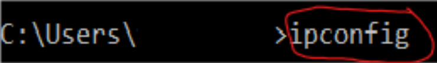
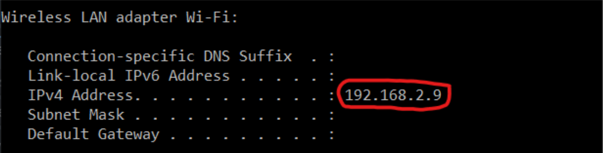

# GameJam2023
you only get one___

**To run the game the following files are needed**
- [GameJam2023.exe](GameJam2023.exe)
- [GameJam2023.pck](GameJam2023.pck)

---

- To get IP address open CMD(Terminal) and type ```ipconfig``` then copy IPv4.



- To get port number choose any between 1024 - 65535 (12345 as an example)

- Share the IP address and port number with people to join. (only works if all the players on the same local network).

---

**check how the game looks like** 
[gameplay.mp4](media/gameplay.mp4)

---

**player controls**

Esc -> exit the game
W A S D -> to walk
space bar -> to jump
mouse left click -> to hit with the stick (only the host have a futuristic stick)
moving mouse cursor -> to move the camera

---
